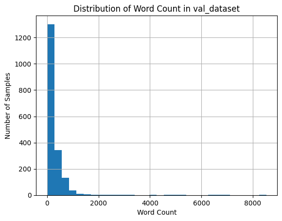
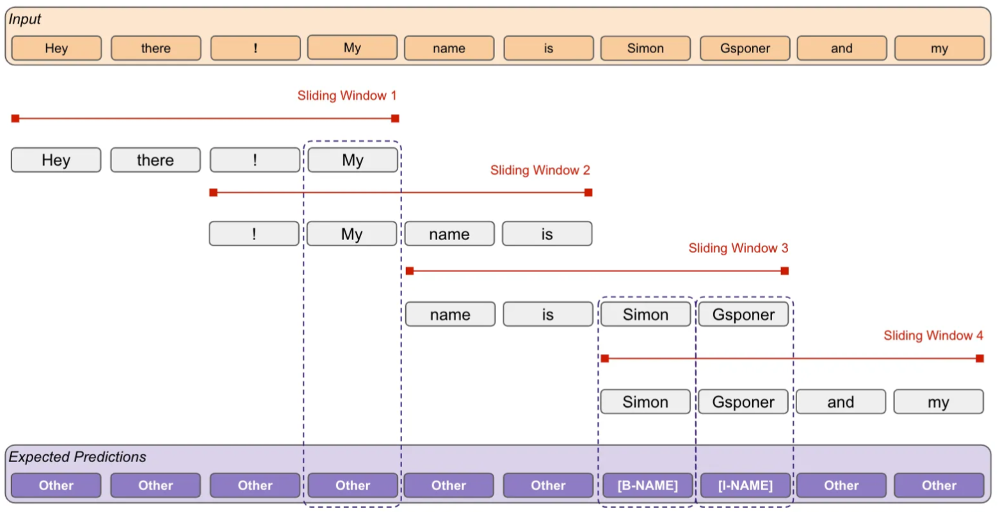

---

# 使用 Transformer 和 ClinicalBERT 对医疗数据进行判断

## 第负一部分：文件结构介绍

`./sql/first/` 内的 `sql` 脚本引用自 [MIT-LCP/mimic-code](https://github.com/MIT-LCP/mimic-code)（记得点进去给作者点个 star）；其中 `icustay_detail.sql` 进行了修改。

`./sql/second/` 内的脚本引用自 [mapo89/continuous-aki-predict](https://github.com/mapo89/continuous-aki-predict/tree/main)（也记得点进去给作者点个 star）。

## 第零部分：环境准备

## 第一部分：MIMIC-III 数据提取（SQL）

### 步骤一：提取视图

假设你已将 `MIMIC-III` 安装在 PostgreSQL 数据库中（建议了解一些数据库基础和 `psql` 命令）。

* 请在 `psql` 命令行中连接到 `mimiciii` 数据库；
* 设置搜索路径（即切换到正确的 schema）：

  ```sql
  SET search_path TO mimiciii;
  ```
* 然后按顺序执行 `./sql/first/` 目录下的所有 SQL 脚本（你也可以自行编写批处理脚本以自动执行这些脚本）：

1. **echo-data.sql**
   提取超声心动图相关数据，为较为独立的模块，可优先执行。

2. **icustay\_detail.sql**
   构建每个 ICU 住院（icustay）期间的基本人口统计信息，是后续分析的基础。

3. **weight-durations.sql**
   计算体重记录的持续时间窗口，常用于分析体重变化或药物剂量估算。

4. **vasopressor-durations.sql**
   提取血管加压药的使用时长，用于评估治疗强度或器官支持情况。

5. **ventilation-durations.sql**
   提取机械通气的使用时间段，分析呼吸支持状态的重要依据。

6. **urine-output.sql**
   汇总尿量信息，是评估肾功能和液体平衡的关键指标。

7. **kdigo-creatinine.sql**
   根据肌酐值构建 KDIGO 分级的关键中间表，作为肾损伤评估的基础。

8. **kdigo-stages-48hr.sql**
   生成 ICU 入院后 48 小时内的 KDIGO 分级视图。

9. **kdigo-stages-7day.sql**
   生成 ICU 入院后 7 天内的 KDIGO 分级视图。

10. **kdigo-stages.sql**
    汇总整个住院期间的 KDIGO 分级情况，作为最终评估视图。

11. **kdigo-uo.sql**
    基于尿量的 KDIGO 分级补充，与肌酐分级互为参考。

> 💡 ChatGPT 提醒：确保在执行过程中连接的是正确的 PostgreSQL 数据库，并使用支持 CTE（公共表表达式）和窗口函数的客户端（如 `psql` 或 DBeaver）。每个脚本执行后建议检查是否创建成功，确认输出是否符合预期。

### 步骤二：提取 CSV 文件

完成“步骤一”后，继续在 `psql` 命令行中按顺序执行 `./sql/second/` 目录下的以下脚本：

```
labs.sql  
vitals.sql  
sedativedurations.sql  
ventilations_at_kdigo_stages_labs_vitals_charttime.sql  
vasopressor_at_kdigo_stages_labs_vitals_charttime.sql  
sedatives_at_kdigo_stages_labs_vitals_charttime.sql 
extract_data.sql  
```

**⚠ 注意：部分内容需要你手动修改。**
在 `extract_data.sql` 中用于导出表格为 CSV 文件的 `COPY (...) TO 'path'` 语句，需将 `path` 修改为当前项目的 `./data/` 路径，例如(实例给的相对路径,如果你不想出错就复制个绝对路径吧)：

```sql
-- extract icu stays with at least one measurement of creatinine or urine output into kdigo_stages_measured.csv
COPY (
    SELECT * 
    FROM mimiciii.kdigo_stages 
    WHERE icustay_id IN (
        SELECT icustay_id 
        FROM mimiciii.kdigo_stages 
        WHERE (creat IS NOT NULL OR uo_rt_6hr IS NOT NULL OR uo_rt_12hr IS NOT NULL OR uo_rt_24hr IS NOT NULL) 
          AND aki_stage IS NOT NULL 
        GROUP BY icustay_id 
        HAVING COUNT(*) > 0
    )
) TO 'data/kdigo_stages_measured.csv' 
WITH CSV HEADER DELIMITER ';';
```

---

## 第二部分：数据准备工作

### 1. 结构化数据（时间序列）的预处理与数据集构建

### 2. 非结构化文本（临床笔记等）的预处理与数据集构建

### 3. 下载预训练模型
- 运行`./preprocessing/get_clinicalBert.ipynb`
- 代码会从`hugging face`上下载模型并保存到`./BERT_model/clinicalbert/`目录下

---

## 第三部分：使用 ClinicalBERT 对文本进行词嵌入

**注意：若计划对 BERT 模型进行微调，请跳过本节和下一节的处理流程。**

* 请依次执行 `./src_bert_embedding.ipynb` 中的所有代码块。在此基础上，你可以对提取出的文本进行进一步清洗或定制化预处理，以提高嵌入效果。

* 由于 BERT 模型对输入长度有限制（最多 512 个 token），因此需要对超长文本进行分段处理。

* 首先，对于每个样本（由患者 ID 与住院 ID 唯一标识），其对应的原始文本通常包含 3000+ 单词，token 数量常常超过 4000。为降低输入长度，我们仅保留该样本中**最新的一条文本记录**用于建模。

* 经上述筛选后，我们在验证集上随机抽取了 5% 样本进行统计，发现每个样本的 token 数量均值为 295，最大值高达 8527，仍存在严重的超长问题。因此，我们采用**滑动窗口（sliding window）机制**对文本进行处理：

  * 若 token 数不足 256，则进行 `padding` 补齐；
  * 若超过 256，则采用窗口长度为 256、步长为 256 的滑动策略，生成多组 `input_ids` 和对应的 `attention_mask`。

| 指标  | 数值      |
| --- | ------- |
| 最大值 | 8527    |
| 平均值 | 295.314 |

**图示：验证集中 5% 样本的单词数量分布**



**图示：滑动窗口机制处理长文本的示意图**
（图源：[Simon Gsponer's blog](https://medium.com/@simon.gsponer/a-comprehensive-guide-using-a-bert-llm-on-texts-exceeding-the-maximum-input-size-47d1b72e397f)）



---

**补充说明**：由于计算资源限制，目前仅选用了每个样本中**最新的一条记录**进行词嵌入，这在一定程度上减少了文本长度，也导致滑动窗口切分出的 `chunk` 数量相对较少。但你也可以选择保留每个样本的**全部文本记录**，从而获得一个维度为 $[chunks * window_size]$ 的输入矩阵。

* 此时，可以考虑进一步使用 **CNN** 提取跨片段特征（详见论文：[Chunking and Convolution for Efficient Long Text Classification with BERT](https://arxiv.org/pdf/2310.20558)）；
* 或者基于 chunks 的时间顺序结构，引入 **LSTM** 或 **Transformer** 等结构建模全局上下文。

这种方法不仅提升了上下文利用率，也为后续多模态融合提供了更强的表达能力。


---

## 第四部分：训练模型（不含 BERT 微调）

## 第五部分：训练模型（包含 BERT 微调，请准备好显卡和时间）

---
